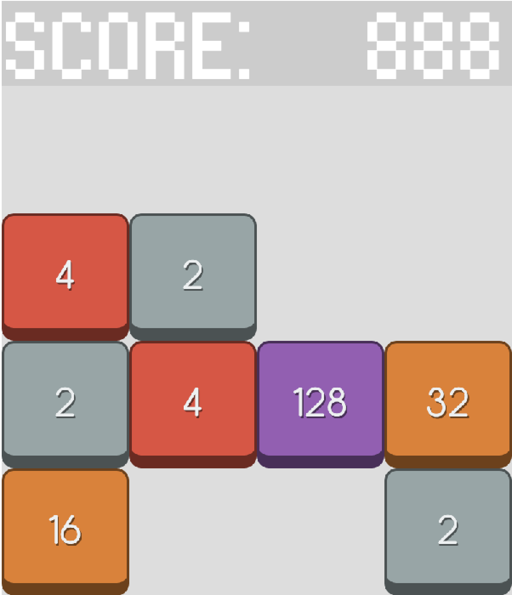

# 2048
This is the third installment of my Phaser game programming series. Following in the footsteps of my [ninjy repository](https://github.com/edwardjcho99/Ninjy) and [checkers repository](https://github.com/edwardjcho99/Checkers), I programmed this game over the course of a week.

# Tools and Frameworks
I used Javascript and the [Phaser library](https://phaser.io/phaser3), a framework for creating 2d games. In addition, I used the [mathjs library](https://mathjs.org/).

# Gameplay
This game is a clone of the classic mobile game, 2048. The rules are simple. You can swipe horizontally or vertically to shift all the tiles in the direction of the swipe. Every time two like tiles are combined, their values are added and combined into a different tile. The goal of the game is to combine the pieces such that you get the highest score.

# Difficulties and What I Learned
After my mishaps in the checkers game, this game went a lot more smoothly. Not to mention that 2048 is simpler than checkers, which sped up progress.

The only major difficulty I ran across was figuring out the algorithm for joining the tiles together. Joining tiles was easy, but joining multiple tiles at the same time was harder. I found a useful [video](https://www.youtube.com/watch?v=JSn-DJU8qf0) which showed a simple solution to this problem.

Also, [this YouTube tutorial series](https://www.youtube.com/watch?v=frRWKxB9Hm0) by Luis Zuno :pray: helped me a ton.
